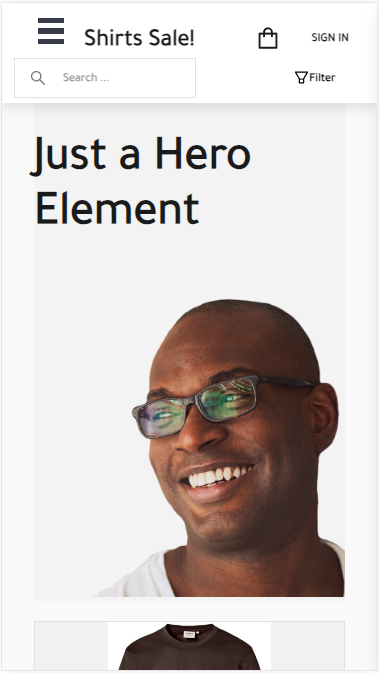
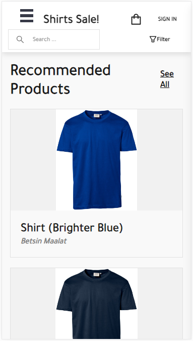
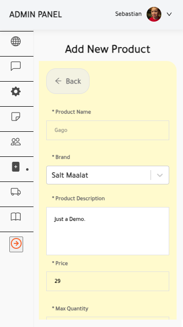

# React Shop with Firestore, Redux, Redux Saga, and Stripe Payment Integration

Welcome to the React Shop project with Firestore, Redux, Redux Saga, and Stripe payment integration! This e-commerce web application is built with React for the client, utilizing Firestore for data storage, Redux for state management, Redux Saga for handling side effects, and Node.js with Express for the server, featuring secure payment processing through Stripe.

<div align="center">


</div>

## Table of Contents

- [Getting Started](#getting-started)
  - [Prerequisites](#prerequisites)
  - [Installation](#installation)
- [Configuration](#configuration)
  - [client Configuration](#client-configuration)
  - [Server Configuration](#server-configuration)
- [features](#features)
- [Usage](#usage)
  - [Running the Application](#running-the-application)
- [Folder Structure](#folder-structure)
- [Authentication](#authentication)
- [License](#license)

## Getting Started

### Prerequisites

Before you begin, ensure you have the following software installed on your machine:

- Node.js and npm
- Git

### Installation

1. Clone the repository to your local machine:

   ```bash
   git clone https://github.com/s2seweis/ReactShop-v01.git
   ```

2. Navigate to the project directory:

   ```bash
   cd testShop-CRUD-Salinaka
   ```

3. Install dependencies for both the client and server:

   ```bash
   # Install client dependencies
   cd client
   npm install

   # Install server dependencies
   cd ../server
   npm install
   ```

## Configuration

### client Configuration

1. Open the `client/src/services/config.js` file.

2. Update the configuration settings as needed, including Firestore credentials and Stripe keys.

### Server Configuration

1. Open the `server/.env` file.

2. Set your Stripe secret/public key inside of the .env:

   ```env
   STRIPE_SECRET_KEY=your_stripe_secret_key
   STRIPE_PUBLISHABLE_KEY=your_stripe_publishable_key
   STATIC_DIR=../client/public
   ```
   Replace `your_stripe_secret_key` with your actual Stripe secret key.

### Firestore Configuration

1. Create a new Firestore project on the [Firebase Console](https://console.firebase.google.com/).

2. Obtain the Firestore configuration object from your Firebase project settings.

3. Open the `client/src/services/config.js` file.

4. Update the Firestore configuration:

   ```javascript
   const firebaseConfig = {
     apiKey: "your_api_key",
     authDomain: "your_auth_domain",
     projectId: "your_project_id",
     // ... other config properties
   };
   ```

   Replace the placeholder values with your actual Firebase configuration.

## Features 

### Client

* Admin CRUD operations
* Firebase authentication
* Firebase auth provider authentication
* Account creation and edit
* Add/ delete products
* Manage Users
* Manage Orders
* Extrea Ingredients Component
* Stripe Integration - via Express

### Server
* Stripe Integration via Webhook

## Usage

### Running the Application

1. Start the server server:

   ```bash
   cd server
   npm start
   ```

   The server server will be running on http://localhost:5000.

2. Start the client application:

   ```bash
   cd client
   npm start
   ```

   The React app will be accessible at http://localhost:3000.

## Folder Structure

```
/react-shop-firestore-stripe
|-- /client           # React client code
|-- /server            # Node.js and Express server code
|-- .gitignore
|-- README.md           # Project documentation
```

## Authentication

### Admin: 
weissenborn20seb@gmail.com
Password:
Gesetz123

### User:
weissenborn21@gmail.com 
Password:
Gesetz123

## License

This project is licensed under the [MIT License](LICENSE).

<div align="center">


</div>

<div align="center">

</div>